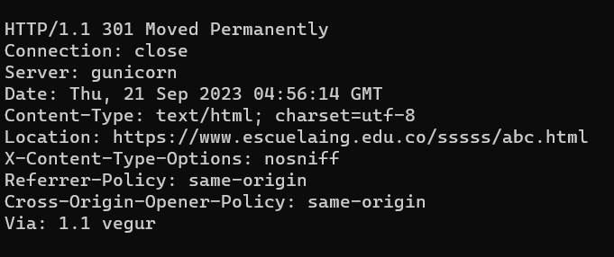
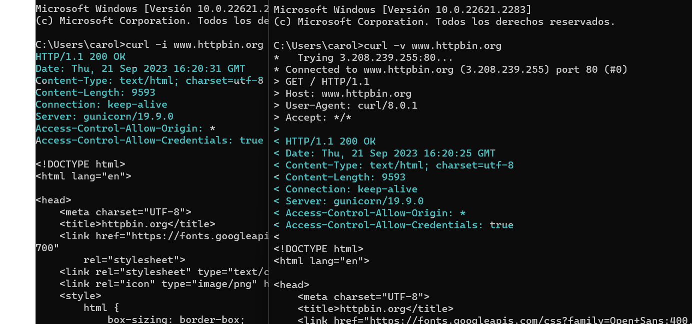

# LABORATORIO 5 - SPRING MVC INTRODUCTION

## INTEGRANTES
- Andrea Valentina Torres Tobar
- Carolina Medina Acero 

## INTRODUCCIÓN A PROYECTOS WEB ~ RESPUESTAS

### PARTE I. - JUGANDO A SER UN CLIENTE HTTP
- Revise el resultado obtenido

     

- ¿Qué codigo de error sale?revise el significado del mismo en la lista de códigos de estado HTTP.
    - Sale el codigo "301 Moved Permanently" que significa  que el recurso se ha movido permanentemente  a una nueva ubicación.

- ¿Qué otros códigos de error existen?, ¿En qué caso se manejarán?
    - Respuestas informativas (100–199),
    - Respuestas satisfactorias (200–299),
    - Redirecciones (300–399),
    - Errores de los clientes (400–499),
    - Errores de los servidores (500–599).

- Ahora, solicite GET /html. HTTP/1.1 Host: www.httpbin.org ¿Qué se obtiene como resultado?
    - obtenemos un parrafo  de la novela Moby-Dick osea obtemos  un 200 OK  La solicitud se completó con éxito, y la respuesta contiene la información solicitada.

-  ¿Cuál es la diferencia entre los verbos GET y POST?
    - Get: Se utiliza para solicitar datos  de un recurso especificado.
        - Envio de datos:  los datos se envían como parte de la URL, a través de los parámetros de consulta  ejemplo :(?).
        - cache:Almacenan temporalmente datos. 

    - Post:  se utiliza para enviar datos al servidor para su procesamiento. 
        - Envio de datos: los datos se envían en el cuerpo de la solicitud, no en la URL a diferencia del get. 
        - cache: los datos no se almacenan en el navegador.

-  ¿Qué otros tipos de peticiones existen?

   - PUT: Se utiliza para actualizar o crear un recurso en el servidor en una ubicación específica. 
   - DELETE: Se utiliza para eliminar un recurso específico en el servidor en una ubicación determinada. 
   - PATCH: Se utiliza para aplicar modificaciones parciales a un recurso en el servidor.
   - HEAD: Similar a GET, pero se utiliza para obtener solo los encabezados de respuesta sin el cuerpo del recurso.
   - OPTIONS: Se utiliza para obtener información sobre las opciones de comunicación disponibles para el recurso de destino. 
   - CONNECT: Se utiliza para establecer una conexión de red con el recurso de destino, a menudo para establecer una conexión segura a través de un proxy.
   - TRACE: Se utiliza para realizar un seguimiento del camino de una solicitud a través de servidores intermedios. Generalmente se usa con fines de depuración y diagnóstico.

- ¿Cuáles son las diferencias de "curl -v" y "curl -i" con los diferentes parámetros?
Ambas sirven para realizar solicitudes http, por lo que vemos el curl -v habilita una información mas detallada nos muestra tanto la solicitud como las respuesta   y  la de  curl -i  solo nos muestra los encabezados de la respuesta http.

     

### PARTE II. - HACIENDO UNA APLICACIÓN WEB DINÁMICA USANDO EL PATRÓN MVC

### PARTE III. - APLICACIÓN MVC PARA CONSUMO DE SERVICIO RESTful

### PARTE IV. - APLICACIÓN MVC JUEGO

### REFERENCIAS
- parte 1
    - https://developer.mozilla.org/es/docs/Web/HTTP/Methods
    - https://developer.mozilla.org/es/docs/Web/HTTP/Status 